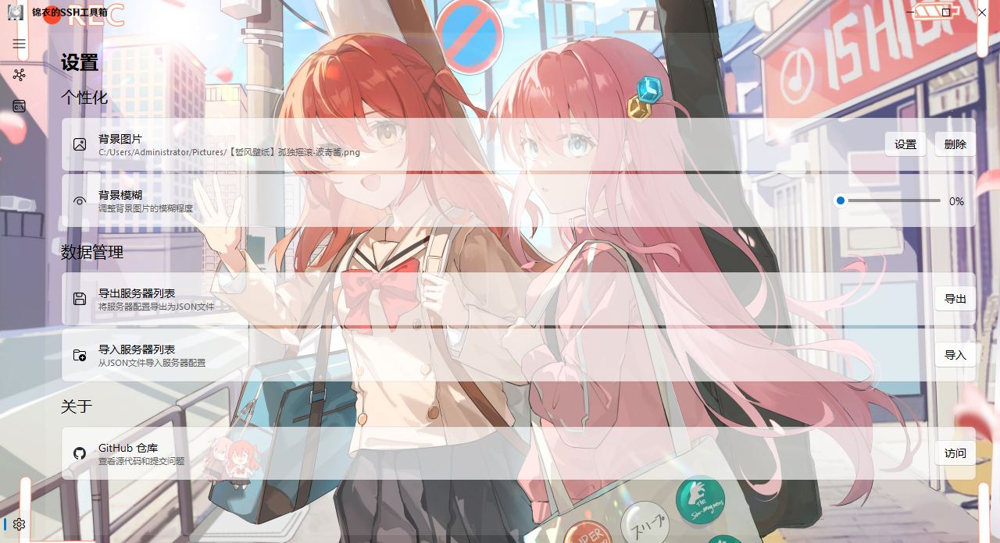

## 说明
无聊折腾，UI使用了[PyQt-Fluent-Widgets](https://github.com/zhiyiYo/PyQt-Fluent-Widgets)，如果需要修改测试，本地环境请安装**Python**，一时出来的项目当然不会做的特别完善，需要的请自行修改使用。

## 项目文件说明

- `main.py` - 主程序入口，整个应用的框架都在这里
- `ssh.py` - SSH连接管理，负责和服务器建立连接
- `terminal.py` - SSH终端界面，就是那个命令行窗口
- `tabs.py` - 多标签页管理
- `sftp.py` - 文件sftp功能
- `config.py` - 服务器配置管理
- `servers.py` - 服务器列表界面，管理服务器的地方
- `settings.py` - 设置界面，可以改主题背景啥的
- `title.py` - 自定义标题栏
- `about.py` - 关于作者的界面
- `servers.json` - 服务器配置文件，保存的服务器信息都在这里(第一次需要生成)
- `requirements.txt` - 依赖库列表
- `hk4e_zh-cn.ttf` - 字体文件，用于显示中文，来自原神Genshin impact
- `1.ico` - 图标文件

## 如何使用

### 克隆项目

```bash
git clone https://github.com/shijinyiA/sshbox
cd sshbox
```

### 安装依赖
**无法安装请换pip源**，此处不列举
```bash
pip install -r requirements.txt
```

如果遇到依赖安装问题，也可以手动安装：

```bash
pip install PyQt5 qfluentwidgets paramiko
```

### 运行程序

```bash
python main.py
```
### 界面图片
#### 主界面

#### 设置


### 额外:打包成exe

如果你想打包成exe文件，可以这样做：

1. 安装PyInstaller：
```bash
pip install pyinstaller
```

2. 打包命令：
```bash
pyinstaller -F -w -i 1.ico main.py
```

打包后的exe文件在 `dist` 文件夹里。

## 特点

- 背景图片自定义
- 服务器列表自定义
- 支持sftp传输
- 盒子服务器数据导入/导出

## 开源协议
本项目遵循Apache License2.0开源并发布，您可以在遵守协议的前提下自由使用、修改和分发本项目的代码。